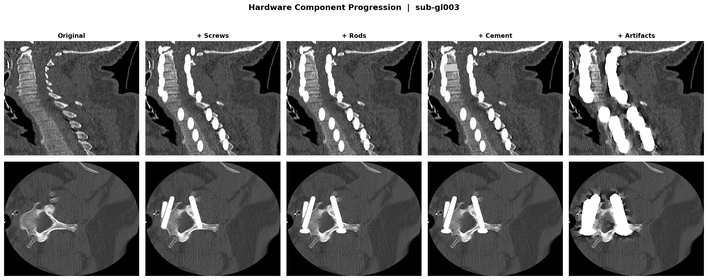
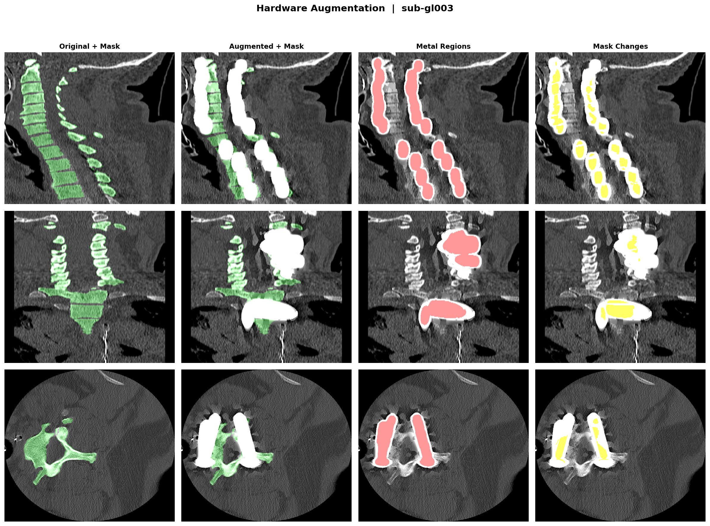
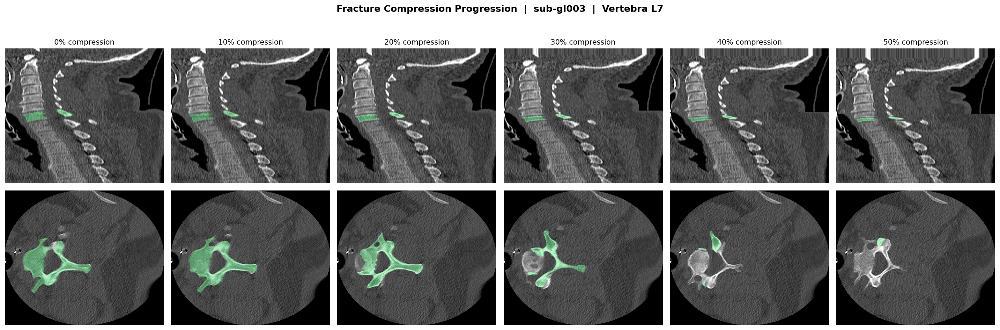
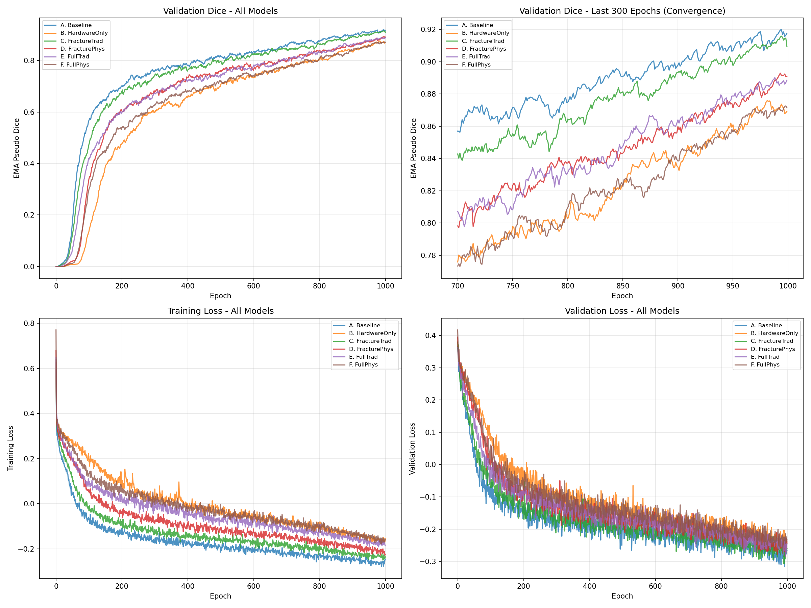

# Augmentation Methods & Ablation Strategy

정상 척추 CT (VerSe dataset)에 적용하는 augmentation 방법과 ablation 실험 전략을 설명한다.

Ablation은 두 가지 fracture approach를 비교한다:
- **Traditional CV** — deformation field 기반 (classical computer vision)
- **Physics-based** — 물리적 property를 직접 모델링

Hardware augmentation은 두 방법에서 **공통 모듈**로 사용된다.

---

## 1. Surgical Hardware Augmentation (공통)

> **파일**: [surgical_hardware.py](file:///gscratch/scrubbed/june0604/wisespine_for_abnormal/augmentation/surgical_hardware.py)

척추 수술 후 CT에서 나타나는 금속 임플란트와 CT imaging artifact를 시뮬레이션한다.

### 1.1 생성 요소

| 요소 | 설명 | 파라미터 |
|------|------|----------|
| **Pedicle Screws** | AO standard trajectory로 삽입 | Ø 4.5–7.5mm, 길이 30–50mm |
| **Connecting Rods** | Bilateral posterior fixation rod | Ø 5–7mm, 인접 level 연결 |
| **Bone Cement** | Vertebroplasty/kyphoplasty 시멘트 | HU 800–1500, multi-blob 형태 |

### 1.2 해부학적 Screw 배치

Screw 경로는 AO Spine 표준에 따라 posterior→anterior 방향으로 삽입되며, **10–15° medial convergence**를 포함한다:

```python
# AO-standard trajectory
medial_angle = np.radians(np.random.uniform(10, 15))  # 10-15° medial tilt
direction = np.array([
    np.cos(medial_angle),           # anterior (primary direction)
    -side * np.sin(medial_angle),   # medial convergence toward midline
    np.sin(caudal_angle),           # slight craniocaudal tilt
])
```

양측(bilateral) 배치가 기본이며, 1–N개 vertebra level에 걸쳐 instrumentation할 수 있다. Connecting rod는 같은 side의 screw head를 craniocaudal 방향으로 연결한다.

### 1.3 CT Metal Artifact 시뮬레이션

Metal artifact는 3가지 물리적 현상을 모델링한다:

| Artifact | 물리적 기전 | 구현 |
|----------|------------|------|
| **Streak** | Photon starvation (fan-beam) | Axial plane에서 metal centroid 기준 방사형 ray cast. Bright/dark band가 교대하며 거리에 따라 exponential decay |
| **Blooming** | Partial volume + scatter | Metal-bone interface에서 Gaussian smoothing (σ = artifact_strength × 3mm) |
| **HU Corruption** | Beam hardening | Metal 주변 10–20mm 반경에서 exponential decay + spatial noise field로 ±500–1500 HU offset |

### 1.4 시각화

#### Hardware Component 추가 과정

Original → +Screws → +Rods → +Cement → +Artifacts 단계별로 component가 추가되는 과정:




#### Multi-View 비교 (3-axis × 4-channel)

Sagittal / Coronal / Axial 3축에서 Original, Augmented, Metal Region, Mask Change를 비교:



- 🟢 Green: segmentation mask
- 🔴 Red: metal detected region (HU > 5000)
- 🟡 Yellow: mask 변경 영역

---

## 2. Traditional CV Fracture Augmentation

> **파일**: [fractures.py](file:///gscratch/scrubbed/june0604/wisespine_for_abnormal/augmentation/fractures.py)

Classical computer vision 기법 — deformation field와 morphological operation — 으로 vertebral fracture를 시뮬레이션한다. 물리 시뮬레이션 없이 순수 CV 기법으로 달성 가능한 최대한의 realism을 목표로 한다.

### 2.1 골절 유형

| 유형 | 확률 | 설명 | 구현 |
|------|------|------|------|
| **Compression** | 50% | 균일한 높이 감소 | Z축 compression deformation field |
| **Wedge** | 30% | Anterior compression > posterior | Gradient deformation field (x 방향) |
| **Burst** | 20% | 방출성 골절 | Radial expansion field + 다중 fracture line |

### 2.2 핵심 기법

**Deformation Field + Interpolation**

`RegularGridInterpolator`로 생성한 deformation field를 CT volume과 mask에 동시 적용:

```python
# Compression: z-방향 uniform squeeze
field[:, :, :, 2] = -(z - center_z) * compression_ratio

# Wedge: anterior에서 posterior로 gradient 적용
compression_gradient = ant_comp + (post_comp - ant_comp) * (x / shape[0])
field[:, :, :, 2] = -(z - center_z) * compression_gradient
```

**Mask-Aware Fracture Lines**

모든 fracture line은 bone mask 내부에만 적용된다. Soft tissue에는 영향을 주지 않는다:

```python
volume[:, :, z] = np.where(
    bone_mask[:, :, z],
    volume[:, :, z] * 0.7,   # edema/hemorrhage darkening
    volume[:, :, z]           # soft tissue unchanged
)
```

**Bone Fragments**

Burst/comminuted fracture에서 골편(bone fragment)이 vertebra 표면에서 2–5mm 이탈하여 분산된다:
- Fragment geometry: ellipsoidal mask
- Fragment HU: cortical bone 수준 (800–1200 HU)
- 배치: vertebral surface voxel에서 outward direction으로 displacement
- 기존 해부학 구조와 겹치지 않도록 constraint

---

## 3. Physics-Based Fracture Augmentation

> **파일**: [fractures_enhanced.py](file:///gscratch/scrubbed/june0604/wisespine_for_abnormal/augmentation/fractures_enhanced.py)

물리적 property를 직접 모델링하여 clinically realistic한 fracture를 시뮬레이션한다. Traditional CV 방법과의 차이는 **골절의 물리적 결과**(column shortening, reactive bone formation, cortical integrity loss)를 명시적으로 구현하는 데 있다.

### 3.1 물리적 효과 파이프라인

골절 시뮬레이션은 6단계로 구성된다:

```
Original → ① Compression → ② Wedge → ③ Endplate Irregularity
         → ④ Fracture Line + Cortical Disruption → ⑤ Sclerosis
         → ⑥ Spinal Column Shortening
```

### 3.2 각 단계 설명

#### ① Uniform Compression (Direct Resampling)

Deformation field 대신 `ndimage.zoom`으로 z축을 직접 압축한다. 이는 실제 뼈가 압력에 의해 부서지면서 높이가 줄어드는 과정을 물리적으로 더 정확하게 표현한다:

```python
new_z = int(original_shape[2] * (1 - compression_ratio))
compressed_ct = ndimage.zoom(ct, (1, 1, new_z / original_shape[2]), order=1)
```

#### ② Wedge Deformation (Kyphotic Deformity)

Anterior column이 posterior보다 더 많이 압축되는 gradient compression. 임상적으로 anterior column failure (AO Type A1 wedge)에 해당한다. x축을 따라 slice-by-slice로 적용:

```python
for x in range(shape[0]):
    local_compression = wedge_ratio * (1 - x / shape[0])  # anterior > posterior
    # Resample each sagittal slice independently
```

#### ③ Endplate Irregularity

실제 골절에서 endplate(추체 상/하면)는 균일하게 무너지지 않는다. Smooth random noise로 endplate surface에 undulation을 추가한다:

- Superior/inferior 각 2–3 slice에 적용
- `gaussian_filter(noise, σ=3)` — 부드러운 collapse pattern
- 심한 collapse 영역에서는 mask도 erosion

#### ④ Fracture Line + Cortical Disruption

Traditional CV approach는 fracture line에서 HU만 낮추지만 (× 0.7), physics-based approach는 두 가지를 구분한다:

| 영역 | 효과 | 물리적 의미 |
|------|------|------------|
| **Bone interior** | HU × 0.5 | Edema, hemorrhage, trabecular disruption |
| **Cortical shell** | HU → 50 (soft tissue level) | **Cortex가 실제로 깨진 것** — CT에서 cortical break 소견 |

```python
# Interior darkening
ct[bone_mask] *= 0.5

# Cortical disruption: cortex breaks → soft tissue HU
cortex = bone_mask & ~ndimage.binary_erosion(bone_mask)
ct[cortex] = min(ct[cortex], 50.0)
```

#### ⑤ Sclerosis (Reactive Bone Formation)

골절 부위 주변에서 bone density가 증가하는 반응성 골형성. **Bone 내부 edge**에만 적용한다:

```python
eroded = ndimage.binary_erosion(bone_mask, iterations=2)
inner_edge = bone_mask & ~eroded   # bone 내부의 2-voxel thick margin
ct[inner_edge] = ct[inner_edge] * 1.3 + 150  # density 증가
```

> [!TIP]
> Sclerosis는 반드시 bone **내부** edge에 적용해야 한다. 외부로 확장하면 soft tissue HU가 비정상적으로 높아져 물리적으로 불가능한 결과가 된다.

#### ⑥ Spinal Column Shortening

Compression fracture의 핵심 물리적 결과: vertebra height가 줄어들면 그 위의 **모든 척추 구조물이 아래로 내려온다**. 이 효과를 무시하면 fractured vertebra와 superior vertebra 사이에 비현실적인 gap이 생긴다.

```python
# Shift everything ABOVE the fracture DOWN by height_loss
shift = original_height - compressed_height
ct[:, :, dst_start:dst_end] = ct[:, :, src_start:src_end]
mask[:, :, dst_start:dst_end] = mask[:, :, src_start:src_end]
```

### 3.3 시각화

#### Compression 단계별 진행

0% → 10% → 20% → 30% → 40% → 50% compression에 따른 vertebra 변화:




#### Traditional vs Physics-Based 비교 (3-axis)

같은 vertebra에 대해 Traditional CV fracture와 Physics-based fracture를 3축으로 비교:


### 3.4 정량적 비교

| 특성 | Traditional CV | Physics-Based |
|------|:-------------:|:-------------:|
| 변형 방식 | Deformation field | Direct resampling (`ndimage.zoom`) |
| Compression | ✓ (10–60%) | ✓ (20–50%) |
| Wedge / Kyphosis | ✓ (gradient field) | ✓ (slice-wise zoom) |
| Bone Fragments | ✓ (ellipsoidal displacement) | — (compression 중심) |
| Fracture Line | HU × 0.7 (bone only) | HU × 0.5 + cortical disruption |
| Sclerosis | — | ✓ (bone inner edge) |
| Endplate Irregularity | — | ✓ (smooth noise) |
| Column Shortening | — | ✓ (superior shift) |
| Cortical Disruption | — | ✓ (cortex → soft tissue HU) |

---

## 4. Augmentation 적용 로직

`train_nnunet.py`에서 각 샘플에 대해 랜덤으로 augmentation type을 선택:

```python
aug_type = np.random.choice(['none', 'hardware', 'fracture'])

if aug_type == 'hardware':
    ct, mask = hardware_aug(ct, mask, spacing)
elif aug_type == 'fracture':
    ct, mask = fracture_aug(ct, mask, spacing)
# 'none' → 원본 유지 (정상 데이터도 학습에 포함)
```

> [!NOTE]
> `none` 옵션이 포함되어 있어, augmentation된 데이터셋에도 정상 데이터가 ~33% 비율로 포함됨.

---

## 5. Ablation Study

### 5.1 실험 구성

| ID | 실험명 | Hardware | Fracture | Dataset ID | 목적 |
|----|--------|:--------:|:--------:|:----------:|------|
| **A** | Baseline | ✗ | ✗ | 500 | Normal segmentation baseline |
| **B** | Hardware Only | ✓ | ✗ | 501 | Hardware aug 단독 기여도 |
| **C** | Fracture Only (Trad.) | ✗ | ✓ (Traditional) | 502 | Traditional CV fracture 단독 |
| **D** | Fracture Only (Phys.) | ✗ | ✓ (Physics) | 503 | Physics-based fracture 단독 |
| **E** | Full (Traditional) | ✓ | ✓ (Traditional) | 504 | Hardware + Traditional fracture |
| **F** | Full (Physics) | ✓ | ✓ (Physics) | 505 | **Main method** — Hardware + Physics fracture |

### 5.2 핵심 비교

| 비교 | 분석 내용 |
|------|-----------|
| **A vs F** | 전체 augmentation 효과 (main result) |
| **B, C, D** | Component 별 단독 기여도 |
| **C vs D** | Traditional CV vs Physics-based fracture 직접 비교 |
| **E vs F** | Fracture 방법론 차이가 full pipeline에 미치는 영향 |

### 5.3 평가 Metric

- **Dice Score** — per-vertebra segmentation accuracy
- **HD95** — 95th percentile Hausdorff distance
- Test set: (1) Normal VerSe test split  (2) Synthetic abnormal test data

### 5.4 Training Results (1000 Epochs)

모든 모델은 nnU-Net 3d_fullres, fold 0, 2-GPU DDP로 학습. Validation은 fold 0의 205 cases (전체 1023 중).

#### EMA Pseudo Dice on Validation (Normal Spine)

| ID | Method | EMA Dice | Last 50 avg | Last 200 avg | Trend | Status |
|----|--------|:--------:|:-----------:|:------------:|:-----:|:------:|
| **A** | Baseline | **0.918** | 0.914 | 0.900 | +0.012 ↑ | still improving |
| **B** | HardwareOnly | 0.869 | 0.867 | 0.841 | +0.021 ↑ | still improving |
| **C** | FractureTrad | 0.909 | 0.909 | 0.890 | +0.013 ↑ | still improving |
| **D** | FracturePhys | 0.891 | 0.882 | 0.860 | +0.024 ↑ | still improving |
| **E** | FullTrad | 0.889 | 0.884 | 0.862 | +0.020 ↑ | still improving |
| **F** | FullPhys | 0.871 | 0.867 | 0.840 | +0.022 ↑ | still improving |

> [!IMPORTANT]
> 모든 모델의 recent trend가 양수(+0.01~0.02)로, **1000 epoch에서 아직 수렴하지 않았다.**
> Augmentation이 추가될수록 수렴이 느려지는 경향이 있으며 (hardware/physics 모델의 trend가 가장 큼),
> 추가 학습 시 augmented 모델과 baseline의 gap이 좁혀질 것으로 예상된다.

> [!NOTE]
> 현재 validation set이 **모두 normal spine**이므로, augmentation 모델이 baseline보다 낮은 것은 예상된 결과이다.
> Augmentation의 진정한 효과는 **abnormal test set** (hardware/fracture 포함)에서 평가해야 한다.

#### 수렴 분석

전체 6개 모델의 학습 경향 (Dice, Loss) 비교:



**관찰:**
- Baseline (A)이 가장 빠르게 수렴하며, augmentation이 많을수록 학습 속도가 느려진다
- Hardware augmentation (B)은 단독 사용 시 가장 큰 Dice 하락을 유발 — metal artifact가 segmentation을 어렵게 만듦
- Fracture augmentation에서 Traditional CV (C)가 Physics-based (D)보다 높은 Dice 달성 — 추가 학습 필요
- Full pipeline (E, F)에서도 Traditional이 Physics보다 약간 높음 — 동일 경향

#### 다음 단계

1. **추가 학습**: 모든 모델을 2000 epoch까지 연장 학습 (수렴 미완료)
2. **Abnormal Test Set 평가**: synthetic abnormal data 생성 후 test inference
3. **Per-Vertebra Level Analysis**: vertebra별 Dice를 세분화하여 augmentation 효과 분석
