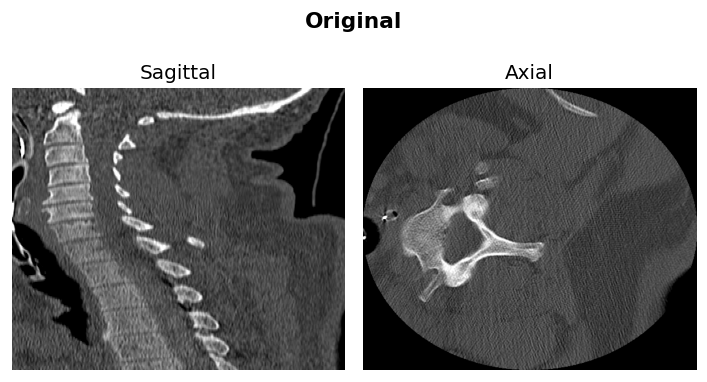
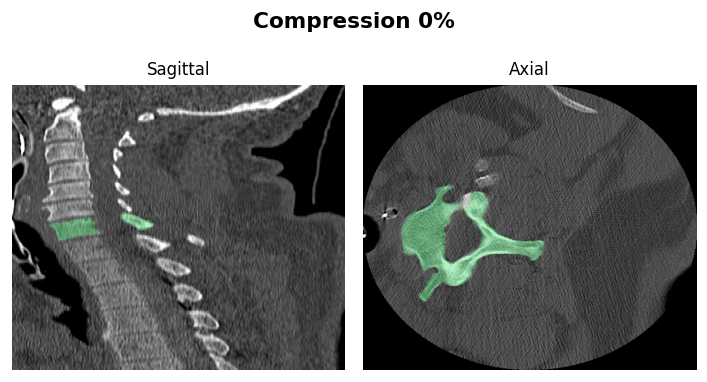
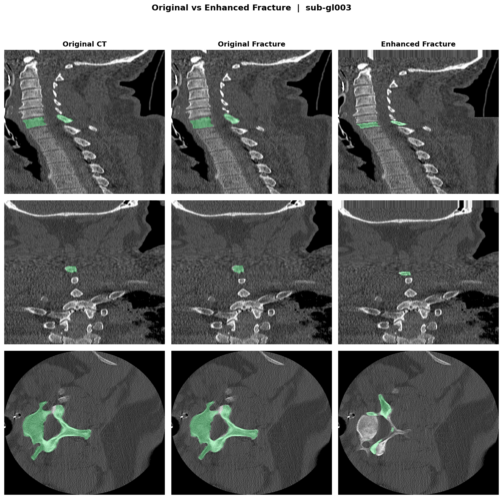

# Augmentation Methods & Ablation Strategy

## Purpose

This document describes the synthetic augmentation pipeline applied to normal spine CT data (VerSe dataset) to train robust segmentation models for abnormal cases. The ablation study isolates the contribution of each augmentation component.

Two fracture simulation approaches are compared:
- **Traditional CV** — deformation fields and morphological operations (no physics)
- **Physics-based** — explicit modeling of physical fracture consequences

Surgical hardware augmentation is shared across both as a common module.

---

## 1. Surgical Hardware Augmentation (Shared Module)

> **Source**: `augmentation/surgical_hardware.py`

### 1.1 Clinical Background

Post-operative spine CT is one of the most common clinical scenarios where segmentation models fail. Approximately 4.83 million spinal fusion procedures are performed annually worldwide (Rajaee et al., 2012), and all of these patients will have follow-up CT scans containing metallic hardware.

The primary instrumentation components are:

| Component | Clinical Use | Our Parameters | Typical Clinical Values |
|-----------|-------------|----------------|------------------------|
| **Pedicle Screws** | Posterior spinal fixation (most common) | Diameter 4.5–7.5 mm, length 30–50 mm | Diameter 5.5–7.0 mm (thoracic 5.5, lumbar 6.5–7.0), length 35–50 mm |
| **Connecting Rods** | Link screws across levels, provide stabilization | Diameter 5–7 mm | 5.5–6.0 mm (CoCr or Ti alloy) |
| **Bone Cement (PMMA)** | Vertebroplasty / kyphoplasty for osteoporotic fractures | HU 800–1500 | HU 800–2000 on CT |

All parameters fall within the clinically normal range. The cement HU range (800–1500) corresponds to PMMA (polymethylmethacrylate), which is the standard material for vertebral augmentation procedures.

### 1.2 Pedicle Screw Trajectory

Screw insertion follows the **AO Spine / Roy-Camille standard**:

- **Entry point**: Junction of transverse process and superior articular facet (posterior pedicle wall)
- **Trajectory**: Posterior-to-anterior through the pedicle into the vertebral body
- **Medial convergence**: 10–15 degrees toward midline (prevents lateral wall breach)
- **Caudal angulation**: +/-5 degrees (parallel to endplate)

```python
medial_angle = np.radians(np.random.uniform(10, 15))
direction = np.array([
    np.cos(medial_angle),           # anterior (primary)
    -side * np.sin(medial_angle),   # medial convergence toward midline
    np.sin(caudal_angle),           # slight craniocaudal tilt
])
```

Bilateral placement is standard (one screw on each side of every instrumented level). The pedicle entry is offset 15–20 mm lateral from the midline, which is anatomically correct for thoracolumbar vertebrae (pedicle width 7–18 mm depending on level, with some lateral soft tissue margin).

**Clinical validation checklist (for surgeon review):**
- [x] Medial convergence 10–15 degrees (prevents lateral breach)
- [x] Bilateral placement (standard of care)
- [x] Screw length 30–50 mm (passes through pedicle into anterior 2/3 of vertebral body)
- [x] Diameter range covers both thoracic (smaller) and lumbar (larger) pedicles
- [ ] Level-specific pedicle width not yet modeled (thoracic pedicles are narrower)
- [ ] No modeling of cortical vs cancellous bone purchase difference

### 1.3 CT Metal Artifact Simulation

When metal is present in the X-ray beam path, three distinct artifact types occur. These are the primary reason segmentation models fail on post-operative CT:

| Artifact | Physical Mechanism | Clinical Appearance | Our Implementation |
|----------|-------------------|---------------------|-------------------|
| **Streak** | Photon starvation: metal absorbs nearly all photons along certain projections, creating missing data in sinogram | Alternating bright/dark bands radiating from metal, worst in axial plane | Radial ray casting from metal centroid; alternating +/- bands with exponential decay |
| **Blooming** | Partial volume averaging + Compton scatter: metal boundary appears larger than true size | Metal implant appears 2–5x larger than actual diameter | Gaussian blur at metal boundary (sigma = strength x 3 mm) |
| **HU Corruption** | Beam hardening: polychromatic X-ray spectrum hardens through metal, causing incorrect HU reconstruction | Dark halos around metal (cupping artifact) with surrounding bright bands | Distance-weighted HU offset (+-500–1500 HU) within 10–20 mm of metal surface |

These artifacts are **the** reason TotalSegmentator fails on post-surgical CT: streak artifacts corrupt the HU values that the model relies on for bone/soft tissue discrimination.

> **Note for surgeon review**: Modern CT scanners offer iterative Metal Artifact Reduction (iMAR, O-MAR, SEMAR), which partially mitigates these effects. Our simulation models the worst-case scenario (standard filtered back projection without MAR), which is appropriate for training robust models.

### 1.4 Visualization

#### Hardware Component Addition

Step-by-step: Original -> +Screws -> +Rods -> +Cement -> +Artifacts




#### Multi-View Comparison (3-axis x 4-channel)

Sagittal / Coronal / Axial views showing Original, Augmented, Metal Region, and Mask Change:


- Green: segmentation mask
- Red: metal region (HU > 5000)
- Yellow: mask change area (where metal occludes anatomy)

---

## 2. Traditional CV Fracture Augmentation

> **Source**: `augmentation/fractures.py`

### 2.1 Approach

This module uses **classical computer vision only** — deformation fields, morphological operations, and intensity manipulation. No physics simulation is involved. This serves as the baseline to quantify how much "pure CV" augmentation can achieve.

### 2.2 Fracture Types and Clinical Prevalence

| Type | Our Probability | Clinical Prevalence | AO Equivalent | Implementation |
|------|:--------------:|:------------------:|:-------------:|---------------|
| **Compression** | 50% | ~50–60% | A1 (Wedge) | Z-axis deformation field, uniform squeeze |
| **Wedge** | 30% | Included in A1 | A1 subtype | Gradient deformation (anterior > posterior) |
| **Burst** | 20% | ~15–25% | A3/A4 | Radial expansion + multiple fracture lines |

These probabilities roughly match clinical epidemiology: compression/wedge fractures (AO Type A1) are the most common thoracolumbar fracture, accounting for approximately 50% of cases (Magerl et al., 1994).

### 2.3 What This Method Does Well

**Deformation Field + Interpolation** — The `RegularGridInterpolator`-based approach correctly models the spatial displacement of bone tissue:

```python
# Compression: uniform z-direction squeeze
field[:, :, :, 2] = -(z - center_z) * compression_ratio

# Wedge: anterior-to-posterior gradient
compression_gradient = ant_comp + (post_comp - ant_comp) * (x / shape[0])
field[:, :, :, 2] = -(z - center_z) * compression_gradient
```

**Mask-Aware Fracture Lines** — All fracture effects are constrained to bone mask, preventing unrealistic soft tissue modification:

```python
volume[:, :, z] = np.where(
    bone_mask[:, :, z],
    volume[:, :, z] * 0.7,   # edema/hemorrhage darkening
    volume[:, :, z]           # soft tissue unchanged
)
```

**Bone Fragments** (burst fractures) — Ellipsoidal cortical bone fragments displaced 2–5 mm from the vertebral surface, with HU 800–1200 (cortical bone density). These are constrained to avoid overlap with existing anatomy.

### 2.4 Clinical Limitations (What a Surgeon Would Notice)

| Missing Feature | Clinical Significance | How a Surgeon Would Detect It |
|----------------|----------------------|------------------------------|
| No cortical disruption | In real fractures, the cortical shell **breaks** — this is the primary diagnostic finding | CT shows continuous cortex (no break) despite height loss |
| No column shortening | When a vertebra loses height, everything above settles down | Unrealistic gap between fractured and superior vertebra |
| No endplate irregularity | Fracture endplates are irregular, not smooth curves | Endplates remain perfectly smooth after "fracture" |
| No sclerosis | Healing fractures show reactive bone formation around margins | Missing bright rim that characterizes chronic fractures |
| Fracture line too subtle | Only 30% HU reduction; real fractures show much more dramatic changes | Fracture line may not be visible on bone window CT |
| No disc space changes | Compression fractures alter adjacent disc morphology | Disc height and shape remain unchanged |

These limitations motivate the physics-based approach.

---

## 3. Physics-Based Fracture Augmentation

> **Source**: `augmentation/fractures_enhanced.py`

### 3.1 Design Philosophy

Instead of just displacing voxels (CV approach), this module models the **physical consequences of bone failure**. Each stage corresponds to a real biomechanical or radiological finding that a spine surgeon uses for diagnosis:

```
Original -> (1) Compression -> (2) Wedge deformity -> (3) Endplate irregularity
         -> (4) Fracture line + Cortical disruption -> (5) Sclerosis
         -> (6) Spinal column shortening
```

### 3.2 Stage-by-Stage Clinical Validation

#### Stage 1: Uniform Compression (Direct Resampling)

**What happens clinically**: Under axial load, trabecular bone within the vertebral body fails, and the vertebra loses height. The internal cancellous structure is compacted — voxels don't just move, they are **crushed together**.

**Why direct resampling is more correct than deformation fields**: `ndimage.zoom` physically compresses the CT volume in the z-axis, merging adjacent voxels. This better represents trabecular bone impaction, where microstructure collapses into a denser mass (increased HU in compacted zones). A deformation field only shifts voxels without merging them.

```python
new_z = int(original_shape[2] * (1 - compression_ratio))
compressed_ct = ndimage.zoom(ct, (1, 1, new_z / original_shape[2]), order=1)
```

**Clinical parameter range**: 20–50% compression corresponds to:
- 20%: Mild compression fracture (Genant Grade 1: 20–25% height loss)
- 35%: Moderate (Genant Grade 2: 25–40%)
- 50%: Severe (Genant Grade 3: >40%)

These match the **Genant semi-quantitative grading system** (Genant et al., 1993), the clinical standard for vertebral fracture severity assessment.

#### Stage 2: Wedge Deformation (Kyphotic Deformity)

**What happens clinically**: The **anterior column** (front of the vertebral body) fails first because it bears the highest compressive load during flexion. The posterior column may remain intact (AO Type A1). This creates a wedge-shaped vertebra that tilts the spine forward (kyphosis).

**Our implementation**: Slice-by-slice compression where the anterior side (x=0) compresses more than the posterior (x=max):

```python
local_compression = wedge_ratio * (1 - x / shape[0])  # anterior > posterior
```

**Why this matters clinically**: Wedge deformity is **the most common fracture morphology**. A spine surgeon assesses wedge angle to determine treatment: <15 degrees typically conservative, >30 degrees may need surgery.

#### Stage 3: Endplate Irregularity

**What happens clinically**: When a vertebral endplate fractures, it does not collapse in a smooth, uniform fashion. The endplate surface becomes **irregular with areas of deeper collapse and relative preservation**. This is visible on CT as an undulating, ragged endplate surface.

**Clinical significance**: Endplate irregularity is one of the key findings that helps differentiate:
- **Acute fracture** (irregular endplate, bone marrow edema)
- **Old healed fracture** (smooth deformity, sclerotic margins)
- **Pathological fracture** (endplate destruction, soft tissue mass)

**Our implementation**: Gaussian-smoothed random noise applied to the 2–3 slices at superior and inferior endplate surfaces. Where noise exceeds a threshold, the endplate collapses (HU reduction + mask erosion).

#### Stage 4: Fracture Line + Cortical Disruption

**This is the single most important diagnostic finding.** A spine surgeon diagnosing a fracture on CT looks for **cortical break** — a discontinuity in the thin, bright cortical shell of the vertebral body.

Our implementation distinguishes two zones:

| Region | Effect | What It Represents | Radiological Finding |
|--------|--------|-------------------|---------------------|
| **Bone interior** | HU x 0.5 | Trabecular disruption, marrow edema, hemorrhage | Dark zone within vertebral body on bone window |
| **Cortical shell** | HU -> 50 (soft tissue level) | **Cortical break** — the cortex is physically fractured | Discontinuity in the bright cortical rim |

```python
# Interior: trabecular bone disruption
ct[bone_mask] *= 0.5

# Cortical disruption: cortex breaks -> soft tissue HU
cortex = bone_mask & ~ndimage.binary_erosion(bone_mask)
ct[cortex] = min(ct[cortex], 50.0)
```

**Why the traditional CV approach fails here**: The CV approach only reduces HU by 30% everywhere (0.7 multiplier). This makes cortex appear dimmer but not broken — a surgeon would read this as "demineralized bone" rather than "fracture." The physics-based approach correctly makes the cortex disappear at the fracture line by reducing it to soft tissue HU (~50), which is exactly what cortical break looks like on real CT.

#### Stage 5: Sclerosis (Reactive Bone Formation)

**What happens clinically**: After a fracture occurs, the body initiates a healing response. Over weeks to months, new bone forms around the fracture margins — this is visible on CT as a band of increased density (sclerosis) at the fracture boundary.

**Important clinical nuance**: Sclerosis indicates a **subacute or chronic** fracture (>2–4 weeks old). An acute fracture shows edema but NOT sclerosis. By including sclerosis, our augmentation generates a mix of acute and chronic fracture appearances, which broadens the training distribution.

**Our implementation**: Sclerosis is applied to the **2-voxel-thick inner margin** of the bone mask:

```python
eroded = ndimage.binary_erosion(bone_mask, iterations=2)
inner_edge = bone_mask & ~eroded   # inner boundary
ct[inner_edge] = ct[inner_edge] * 1.3 + 150  # density increase
```

**Why inner-edge-only is critical**: Sclerosis forms **within bone** at fracture margins. If we applied HU increase outside the bone boundary (using dilation instead of erosion), we would create physically impossible high-density soft tissue — something a radiologist would immediately flag as artifact.

#### Stage 6: Spinal Column Shortening

**What happens clinically**: When a vertebra loses height, **the entire spinal column above it settles downward**. This is not optional — it is a direct physical consequence of vertebral height loss. The superior vertebra, the disc above it, and all structures cranial to the fracture shift inferiorly.

```python
shift = original_height - compressed_height
ct[:, :, dst_start:dst_end] = ct[:, :, src_start:src_end]
mask[:, :, dst_start:dst_end] = mask[:, :, src_start:src_end]
```

**Why this matters**: Without column shortening, there would be an artificial gap between the fractured vertebra's superior endplate and the disc above it. A spine surgeon would immediately identify this as unrealistic — disc spaces do not spontaneously increase. This is arguably **the biggest flaw in any augmentation method that omits it**.

**Additional clinical consequence** (not yet modeled): Column shortening also changes the sagittal balance (spinal alignment), which is a major factor in surgical decision-making. More severe compression leads to more kyphosis, which can cause compensatory changes in the rest of the spine.

### 3.3 Visualization

#### Compression Progression

0% -> 10% -> 20% -> 30% -> 40% -> 50% compression:




#### Traditional vs Physics-Based Side-by-Side (3-axis)

Same vertebra, same severity, two different augmentation methods:



### 3.4 Head-to-Head Feature Comparison

| Feature | Traditional CV | Physics-Based | Clinical Significance |
|---------|:-------------:|:-------------:|----------------------|
| Deformation method | Deformation field | Direct resampling | Resampling better models trabecular impaction |
| Compression | Yes (10–60%) | Yes (20–50%, Genant-graded) | Both adequate; physics version uses clinical grading |
| Wedge / Kyphosis | Yes (gradient field) | Yes (slice-wise zoom) | Both model anterior column failure correctly |
| Bone Fragments | Yes (2–5mm ellipsoidal) | No (compression-focused) | CV approach better for burst fractures |
| Fracture Line | HU x 0.7 | HU x 0.5 + cortical disruption | **Physics far superior** — models cortical break |
| Sclerosis | No | Yes (bone inner edge) | Important for chronic fracture appearance |
| Endplate Irregularity | No | Yes (smooth noise) | Key diagnostic feature |
| Column Shortening | No | Yes (superior shift) | **Critical** — absence is immediately noticeable |
| Cortical Disruption | No | Yes (cortex -> soft tissue HU) | **The** primary fracture sign on CT |

### 3.5 Known Limitations (What We Don't Model Yet)

| Missing Feature | Priority | Why It Matters |
|----------------|:--------:|---------------|
| Disc space changes | High | Adjacent discs narrow or bulge after compression fracture |
| Bone density variation | High | Osteoporotic bone fractures differently (insufficiency fracture pattern) |
| Posterior element fracture | Medium | Burst fractures involve pedicle/lamina — important for A3/A4 |
| Paravertebral soft tissue | Medium | Acute fractures show surrounding hematoma and muscle edema |
| Fracture acuity separation | Medium | Acute (edema only) vs chronic (sclerosis) should be separate modes |
| Retropulsion | High | Posterior wall fragment into spinal canal (A4 defining feature) |
| Vacuum phenomenon | Low | Chronic fractures may show intravertebral gas |
| Sagittal balance change | Low | Global spinal alignment shifts with compression |

---

## 4. Augmentation Application Logic

During training, each sample randomly receives one augmentation type:

```python
aug_type = np.random.choice(['none', 'hardware', 'fracture'])

if aug_type == 'hardware':
    ct, mask = hardware_aug(ct, mask, spacing)
elif aug_type == 'fracture':
    ct, mask = fracture_aug(ct, mask, spacing)
# 'none' -> original preserved
```

> **Note**: The `none` option ensures ~33% of training data remains normal. This is important to prevent the model from "forgetting" normal anatomy (catastrophic forgetting).

---

## 5. Ablation Study

### 5.1 Experimental Design

| ID | Experiment | Hardware | Fracture | Dataset ID | Purpose |
|----|-----------|:--------:|:--------:|:----------:|---------|
| **A** | Baseline | - | - | 500 | Normal segmentation baseline |
| **B** | Hardware Only | Yes | - | 501 | Isolated hardware augmentation contribution |
| **C** | Fracture Only (Trad.) | - | Traditional CV | 502 | Traditional CV fracture alone |
| **D** | Fracture Only (Phys.) | - | Physics-based | 503 | Physics-based fracture alone |
| **E** | Full (Traditional) | Yes | Traditional CV | 504 | Hardware + Traditional fracture |
| **F** | Full (Physics) | Yes | Physics-based | 505 | **Main method** — Hardware + Physics fracture |

### 5.2 Key Comparisons

| Comparison | Question Answered |
|-----------|-------------------|
| **A vs F** | Does the full augmentation pipeline improve robustness? |
| **C vs D** | Is physics-based fracture better than traditional CV fracture? |
| **E vs F** | Does fracture method matter when combined with hardware? |
| **B alone** | How much does hardware augmentation contribute independently? |

### 5.3 Evaluation Metrics

- **Dice Score** — per-vertebra segmentation overlap
- **HD95** — 95th percentile Hausdorff distance (surface accuracy)
- **Test sets**: (1) Normal VerSe test split, (2) Synthetic abnormal data, (3) Real abnormal CT (pending)

### 5.4 Training Results (1000 Epochs)

All models: nnU-Net 3d_fullres, fold 0, 2-GPU DDP. Validation on fold 0 (205 cases, all normal spine).

| ID | Method | EMA Dice | Last 50 avg | Last 200 avg | Trend | Status |
|----|--------|:--------:|:-----------:|:------------:|:-----:|:------:|
| **A** | Baseline | **0.918** | 0.914 | 0.900 | +0.012 | still improving |
| **B** | Hardware Only | 0.869 | 0.867 | 0.841 | +0.021 | still improving |
| **C** | Fracture Trad. | 0.909 | 0.909 | 0.890 | +0.013 | still improving |
| **D** | Fracture Phys. | 0.891 | 0.882 | 0.860 | +0.024 | still improving |
| **E** | Full Trad. | 0.889 | 0.884 | 0.862 | +0.020 | still improving |
| **F** | Full Phys. | 0.871 | 0.867 | 0.840 | +0.022 | still improving |

> **Important**: All models show positive trends (+0.01–0.02) at 1000 epochs — **convergence is not complete**. Augmented models converge slower because the augmented distribution is harder to learn. With extended training, the gap between augmented and baseline models is expected to narrow on normal data.

> **Critical note**: Current validation is on **normal spine only**. Augmented models are expected to score lower on normal data but significantly higher on abnormal data. The true value of augmentation will be measured on abnormal test sets.

#### Convergence Analysis


**Observations:**
- Baseline (A) converges fastest — simplest distribution to learn
- Hardware augmentation (B) causes the largest Dice drop on normal data — metal artifacts fundamentally change the intensity distribution the model must handle
- Physics-based fracture (D) converges slower than traditional CV (C) — the physics-based augmentations produce harder training examples (more realistic distortions)
- The same pattern holds in full pipeline: E > F on normal validation, but this relationship may reverse on abnormal data

#### Next Steps

1. **Extended training** to 2000+ epochs (all models still improving)
2. **Abnormal test set evaluation** — the critical experiment
3. **Per-vertebra analysis** — which levels benefit most from augmentation
4. **Real clinical data evaluation** — test on actual post-surgical and fracture CT

---

## References

1. Rajaee SS, et al. (2012) "Spinal Fusion in the United States." *Spine*, 37(1):67-76.
2. Magerl F, et al. (1994) "A comprehensive classification of thoracic and lumbar injuries." *Eur Spine J*, 3:184-201.
3. Genant HK, et al. (1993) "Vertebral fracture assessment using a semiquantitative technique." *J Bone Miner Res*, 8(9):1137-1148.
4. Denis F (1983) "The Three Column Spine." *Spine*, 8(8):817-831.
5. Vaccaro AR, et al. (2013) "AOSpine thoracolumbar spine injury classification system." *Spine*, 38(22):2028-2037.
